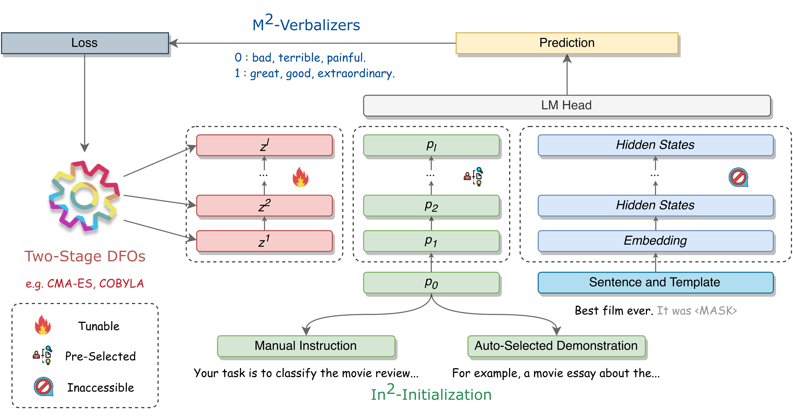

# Make Prompt-based Black-Box Tuning Colorful: Boosting Model Generalization from Three Orthogonal Perspectives

[](https://arxiv.org/abs/2305.08088) 


## Updates

- 2024/01/20: BBT-RGB is accepted by LREC-COLING 2024. 🎉
- 2023/05/03: Release the first version of BBT-RGB, please check our [paper](https://arxiv.org/abs/2305.08088). 🌈


## Introduction

We describe BBT-RGB in this paper, a suite of straightforward and complementary techniques for enhancing the efficiency and performance of black-box optimization. Specifically, our method includes three plug-and-play components: (1) Two-stage derivative-free optimization strategy that facilitates fast convergence and mitigates overfitting; (2) Automatic verbalizer construction with its novel usage under few-shot settings; (3) Better prompt initialization policy based on instruction search and auto-selected demonstration.





## Preparing the Environment

```bash
conda create --name bbtrgb python=3.8
conda activate bbtrgb
pip install transformers==4.1.1
pip install datasets
pip install fastNLP
pip install cma
pip install sklearn
```


## Acknowledgement

This is also a prize-winning solution of the [First International Algorithm Case Competition: PLM Tuning, GD‑HK‑Macau Greater Bay Area](https://iacc.pazhoulab-huangpu.com/). Part of the codes are adapted from [Black-Box-Tuning](https://github.com/txsun1997/Black-Box-Tuning).


## Citation

Please consider citing us if you find this repository useful.👇

```bibtex
@misc{sun2023bbtrgb,
      title         = {Make Prompt-based Black-Box Tuning Colorful: Boosting Model Generalization from Three Orthogonal Perspectives}, 
      author        = {Qiushi Sun and Chengcheng Han and Nuo Chen and Renyu Zhu and Jingyang Gong and Xiang Li and Ming Gao},
      year          = {2023},
      eprint        = {2305.08088},
      archivePrefix = {arXiv},
      primaryClass  = {cs.CL}
}
```

